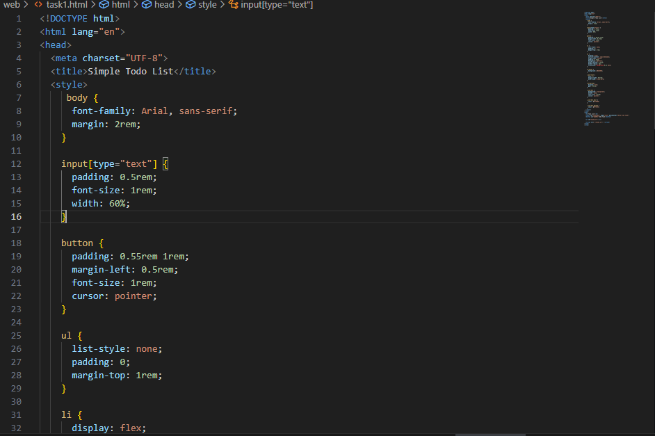
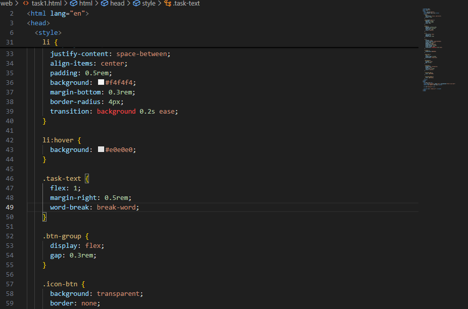
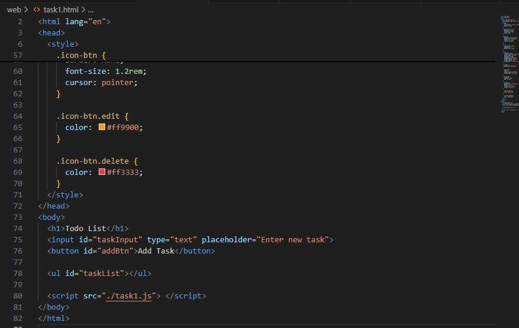
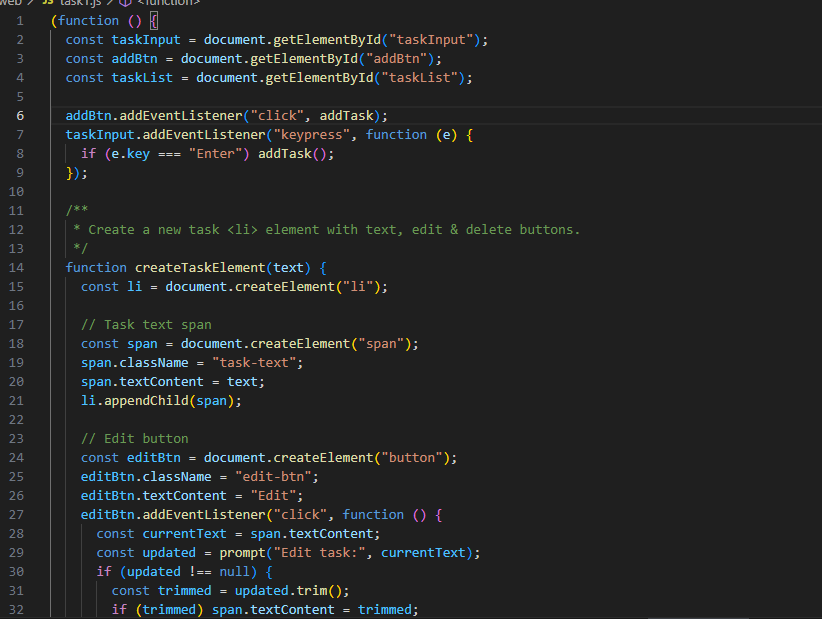
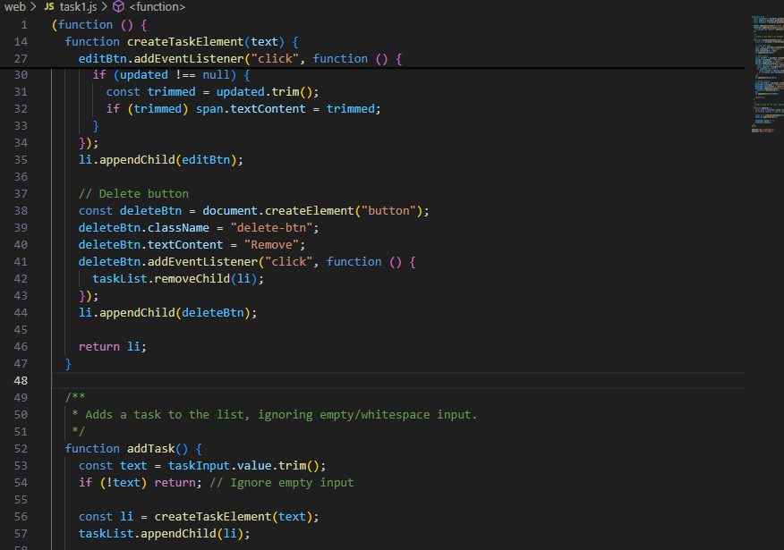
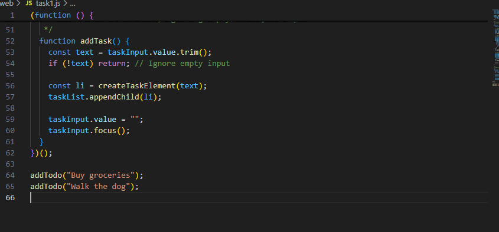
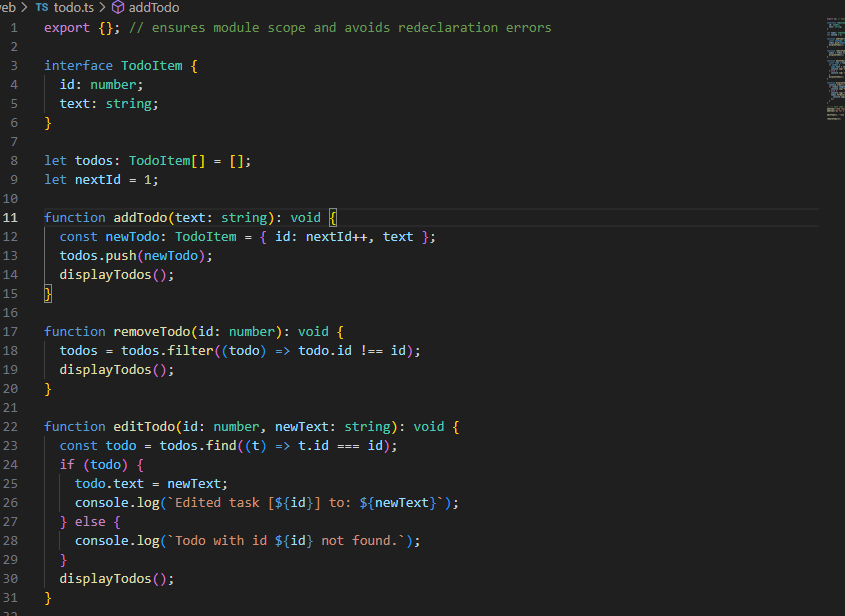
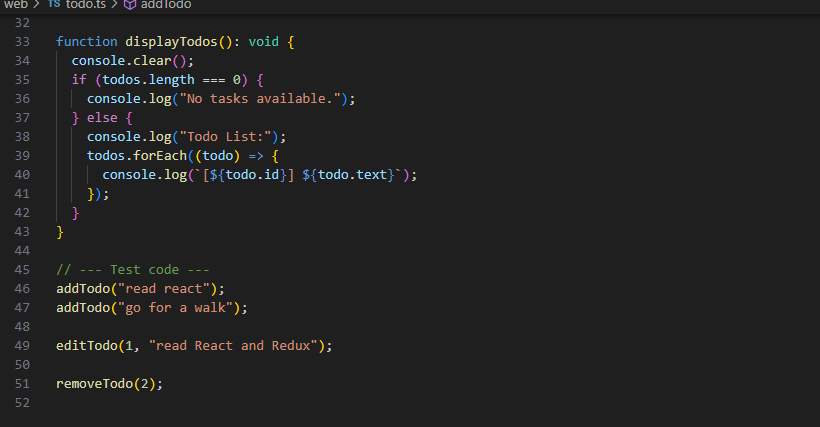

#Todo List Application Projects
This repository contains two simple Todo List applications — one built using JavaScript and the other using TypeScript. Each task demonstrates core concepts such as DOM manipulation, event handling, and code organization.

📝 Task 1: Todo List App with JavaScript
Create a simple Todo List using HTML, CSS, and JavaScript.

✅ Features:
Add new tasks via an input field.

Display tasks in a list.

Remove a task by clicking on it.

Edit existing tasks.

simple html

show html style

an input field for new tasks and a button to add the task to the list.

javascript code that add ,edit function for todo

delete function

🛠️ Task 2: Todo List App with TypeScript
Create a simple Todo List using TypeScript.

✅ Features:
Define a type-safe structure for tasks using interfaces.

Add new tasks.

Remove tasks.

Display tasks in the console.

define interface for a to-do item,Implement functions to add, remove, and display to-do items.

displaytodo

