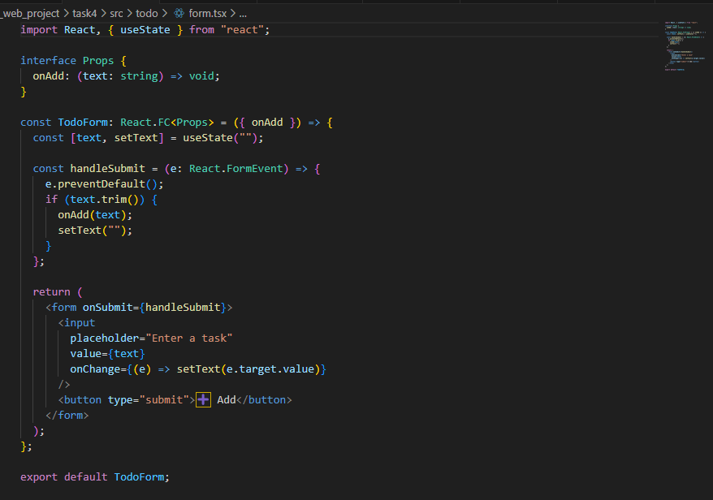
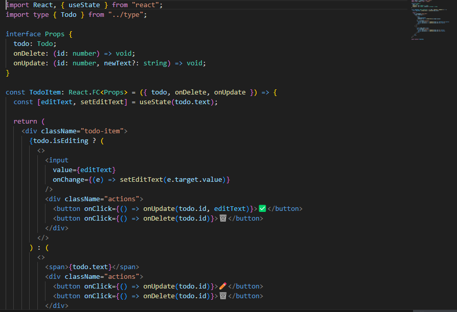
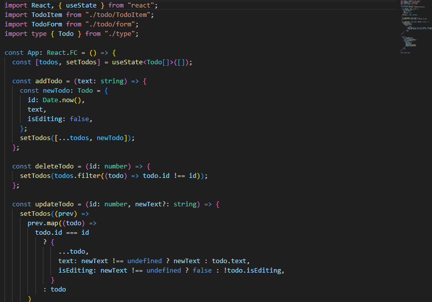
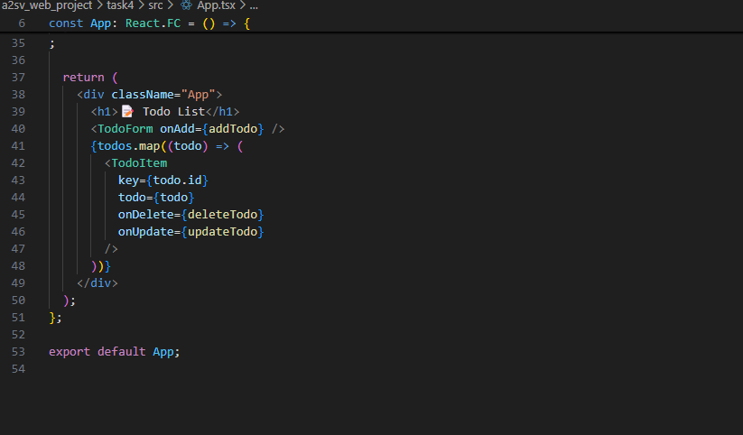
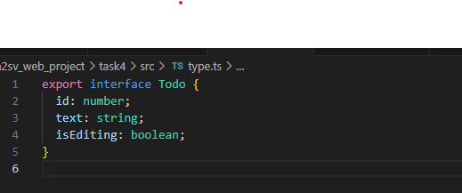

# Task 4: Developing a Simple Todo List app with React and Typescript
Create a Todo List application using React and TypeScript that allows users to add, edit, and delete tasks. Use the concepts covered in the video tutorials to guide you in building the application.

creates todofrom

TodoItem is a React component that displays a single to-do with edit and delete options.
It conditionally shows an input field when the item is in edit mode using todo.isEditing.
Handlers like onUpdate and onDelete are called based on user actions like edit, save, or delete.  below 2 pictures show toditem code

The App component manages the full to-do list using React state.
It allows adding, deleting, and editing to-dos, passing those actions to child components.
Each to-do is rendered using TodoItem, and new items are added via TodoForm.below 2 pic show app.tsx

This TypeScript interface defines the shape of a to-do item.

