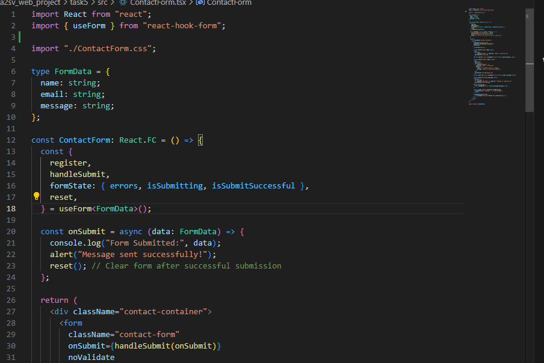
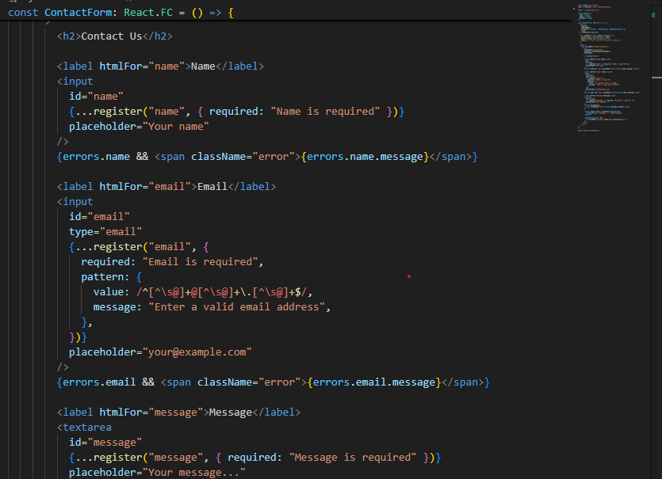
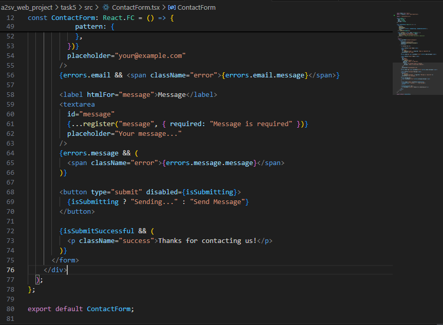
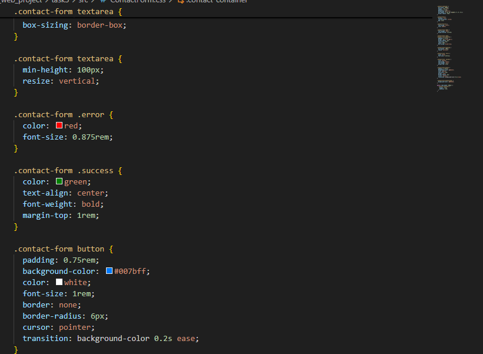
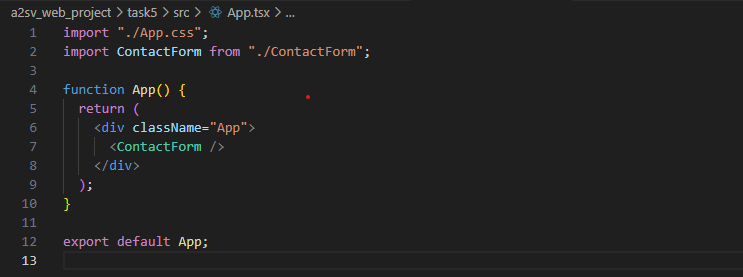

# Task 5: Build a Simple Contact Form using React and the `useForm` hook.

Objectives:
Understand the usage of the `useForm` hook in a React application.
Implement a basic contact form with form validation.
Demonstrate the ability to manage form state and handle form submission using the `useForm` hook.

This is a functional React component that renders a contact form using react-hook-form for validation and handling submissions.
We define a FormData type for strong typing on form fields: name, email, and message.
The useForm hook gives us tools like register to connect inputs, and errors for validation feedback.
On form submit, we log the data, show a success alert, and reset the form.
Each field has validation rules—like required fields and email pattern checking—with error messages shown if validation fails.
There's also some UI state — a loading button during submission and a success message after it's done.

this is css code

This code defines the App component, which renders the ContactForm component inside a styled 

