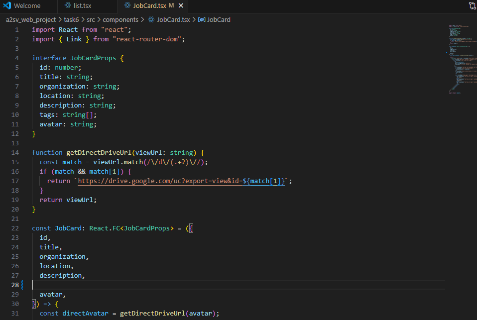
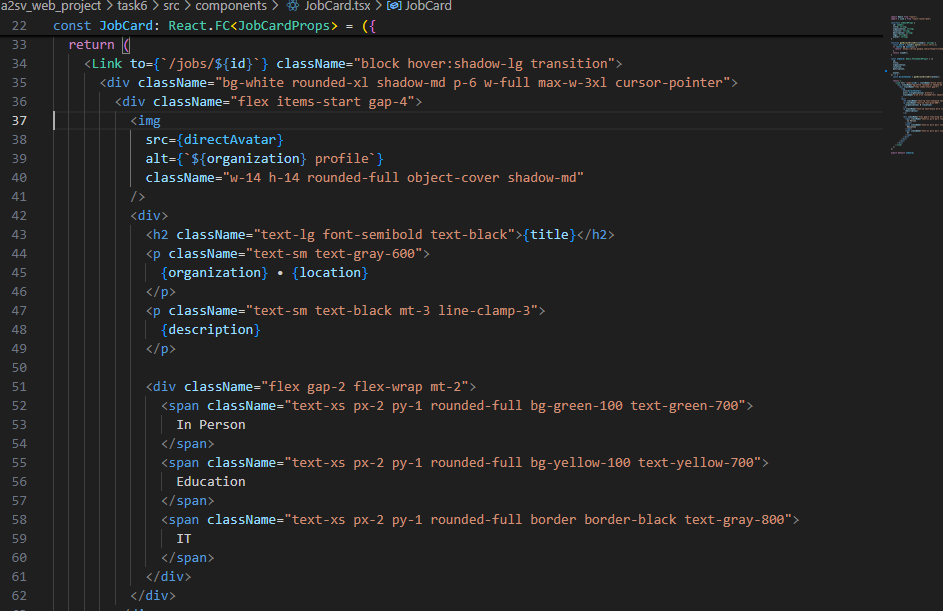
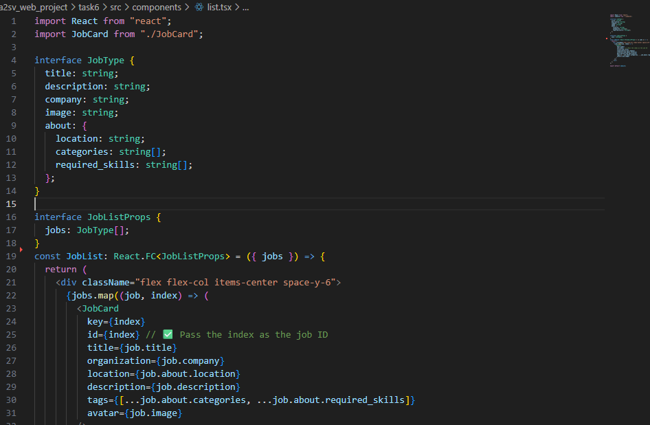
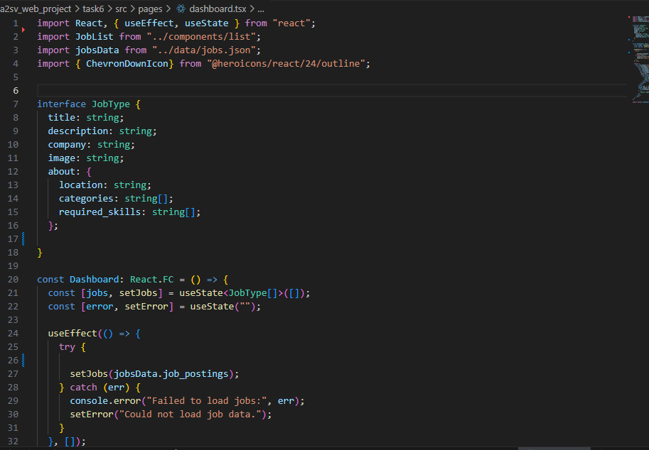
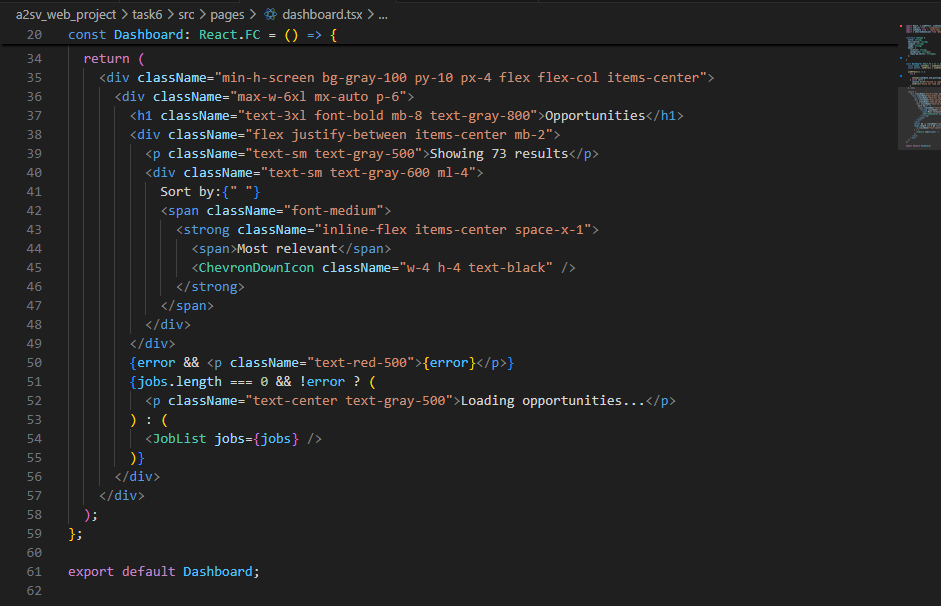
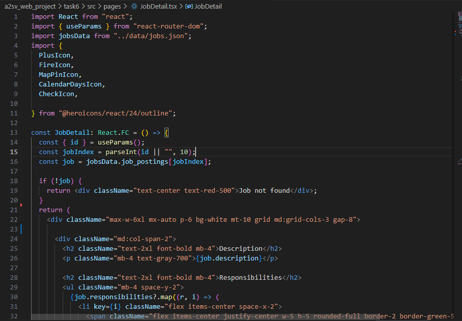
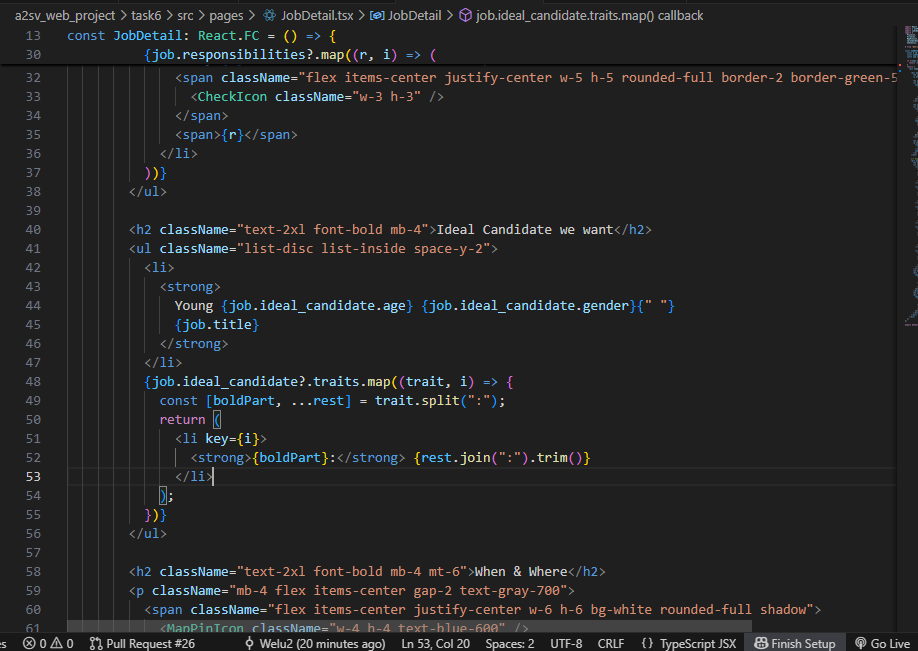
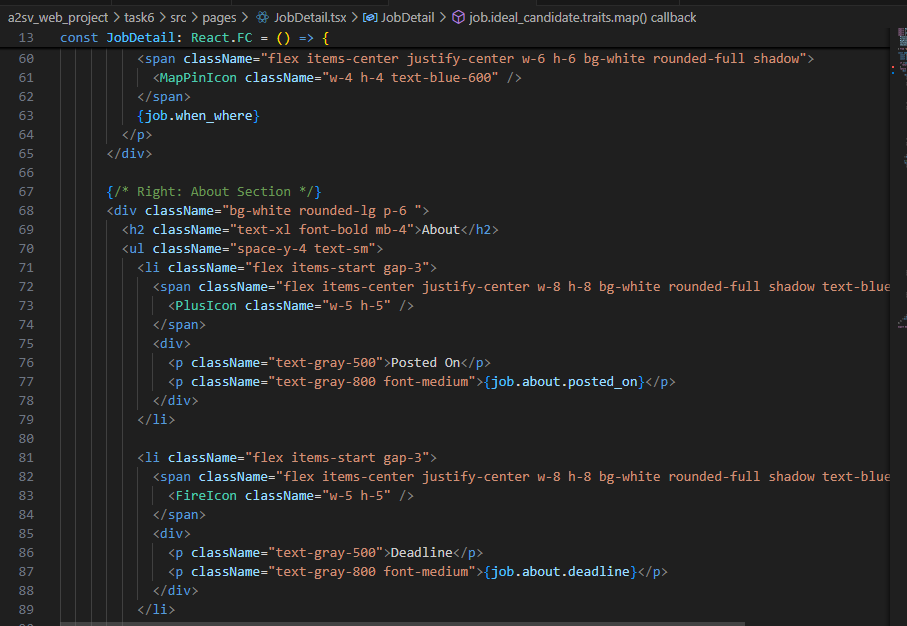
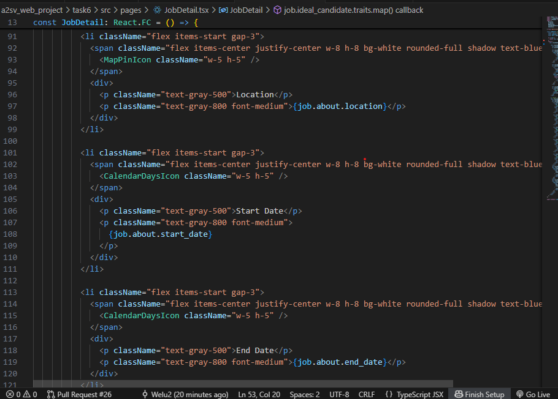
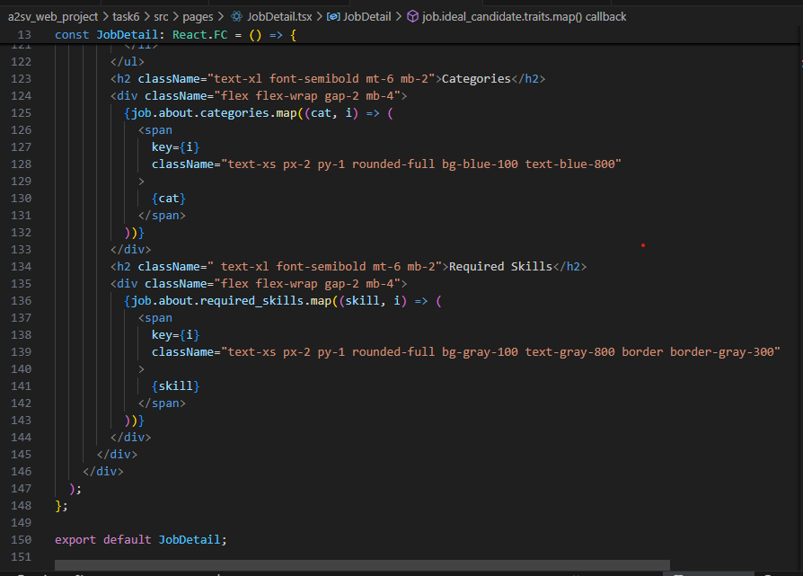

# Task 6: Building Job Listing Application

Objective:

Your task is to create a React component for a card resembling the one provided in the image below. Additionally, you need to populate this card with dummy data and include an avatar image. You also need to create the Job Listing Dashboard.

This JobCard React component displays a job listing preview with title, company, location, description, and tags. It uses a helper function to convert Google Drive avatar links into directly viewable image URLs. When clicked, it navigates to the job's detail page using React Router.
data.json is used for datas/

The JobList component receives a list of job objects and renders a vertical list of JobCard components. It extracts relevant details like title, company, location, and tags from each job. Each card is uniquely identified by the array index used as the job ID.

The Dashboard component displays a list of job opportunities using data loaded from a local JSON file. It manages state for job listings and potential loading errors. On mount, it loads job data into state and handles any exceptions. A sort label with an icon is shown, though sorting functionality isn't implemented. The component conditionally renders a loading message, error, or the list of job cards

The JobDetail component displays detailed information about a single job posting based on the id from the URL. It fetches the job data from a local JSON file and conditionally shows job details, responsibilities, ideal candidate traits, and when/where info. It also includes an "About" sidebar with metadata like dates, location, categories, and required skills. Icons from Heroicons are used for visual structure. If the job isn't found, it displays an error message.

