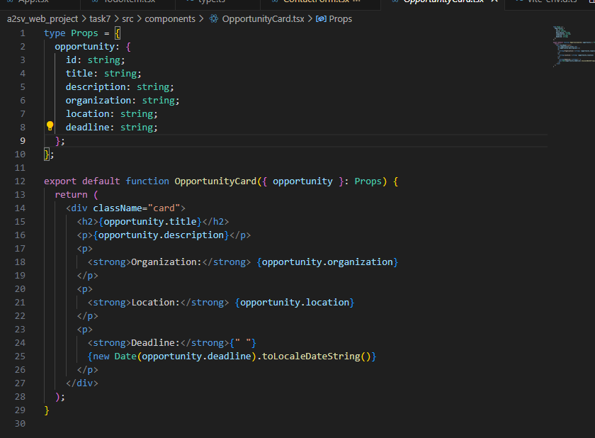
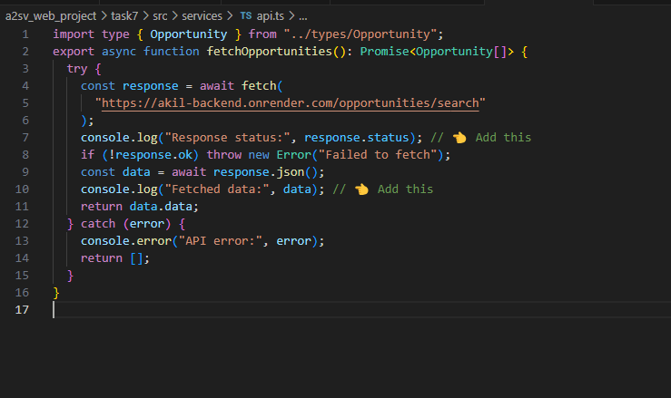
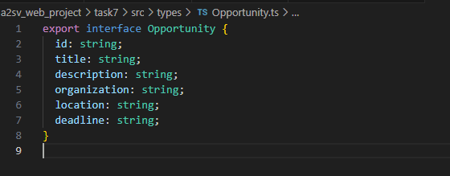
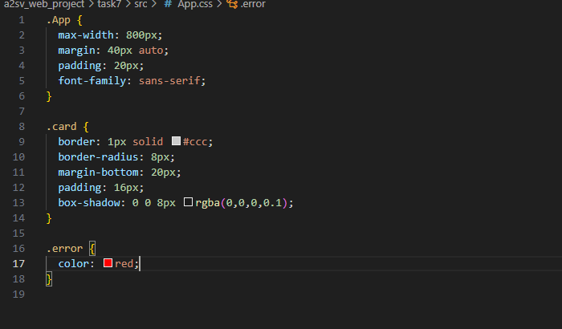
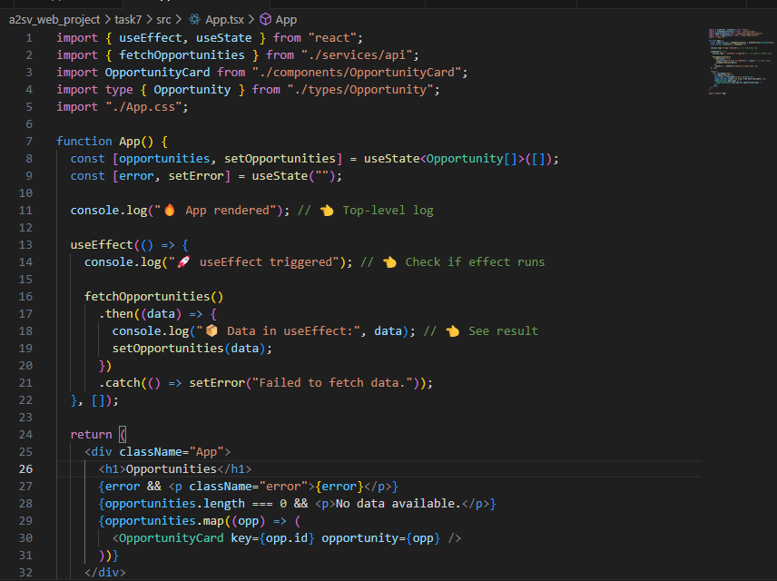
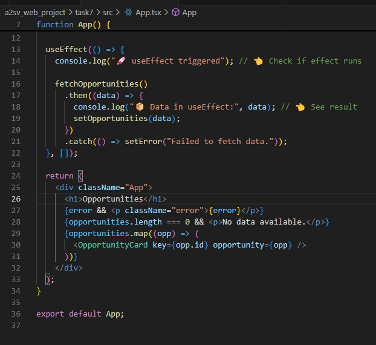

# Task 7: Integrating API Data into the Application

Objective:

Integrate data from a provided API endpoint into your application and populate the cards with this fetched data.

This component OpportunityCard takes an opportunity object as a prop and displays its details like title, description, organization, location, and formatted deadline.
The Props type ensures the structure of the opportunity object is consistent and strongly typed.

This function asynchronously fetches a list of opportunities from an API, logs the response and data, and returns the results or an empty array if there's an error.

This Opportunity interface defines the structure of an opportunity object with fields like id, title, description, organization, location, and deadline.

this is css code

This App component fetches opportunity data using fetchOpportunities when it mounts via useEffect.
It stores the results in opportunities state and handles any fetch errors by setting an error message.
If data is loading or missing, it displays a fallback message; otherwise, it renders a list of OpportunityCard components.
Console logs are added to trace the render flow and data fetching process during development.

