# Task 8: User Authentication

Objective:

Implement authentication functionality using NextAuth in your application, including signup and signin pages, and integrate with provided API endpoints for user registration and authentication.

authOptions code enables email/password login using NextAuth's CredentialsProvider, calling your backend's /login endpoint.It stores the returned accessToken, role, and other custom fields in the JWT and session.It also redirects users to a custom sign-in page at /signin and uses JWT-based sessions.

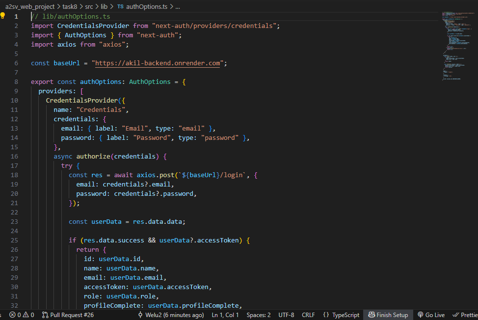
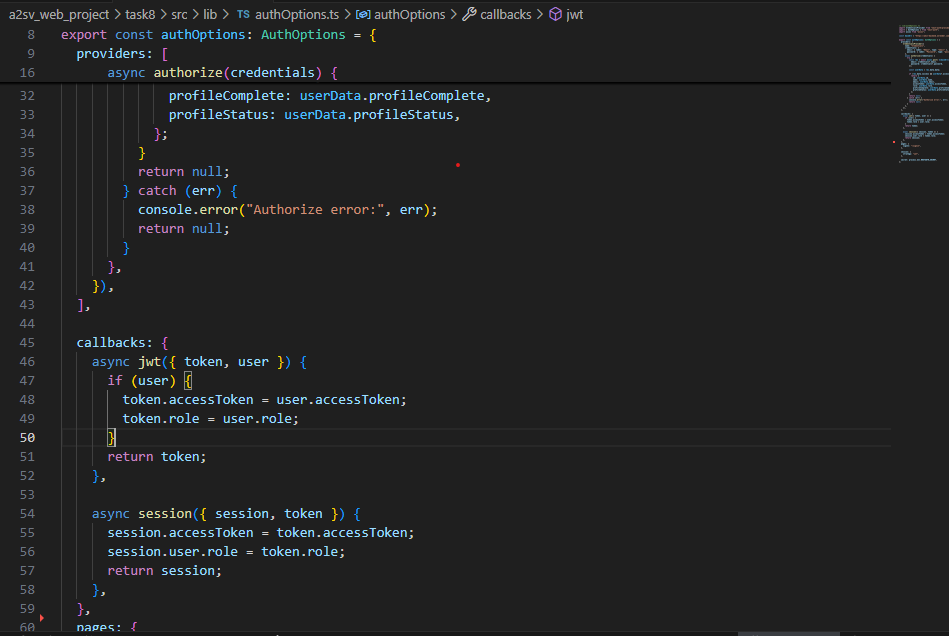
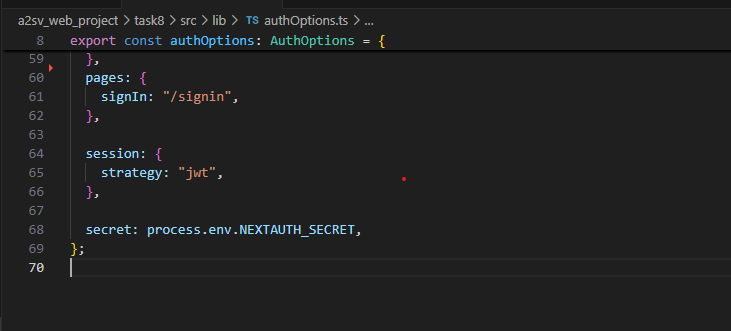

This sets up NextAuth with your custom authOptions, enabling authentication handling for both GET and POST requests at /api/auth/[...nextauth].
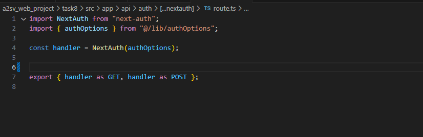

This code extends NextAuth’s default types to include custom fields like accessToken, role, profileComplete, and profileStatus on the user session and JWT.
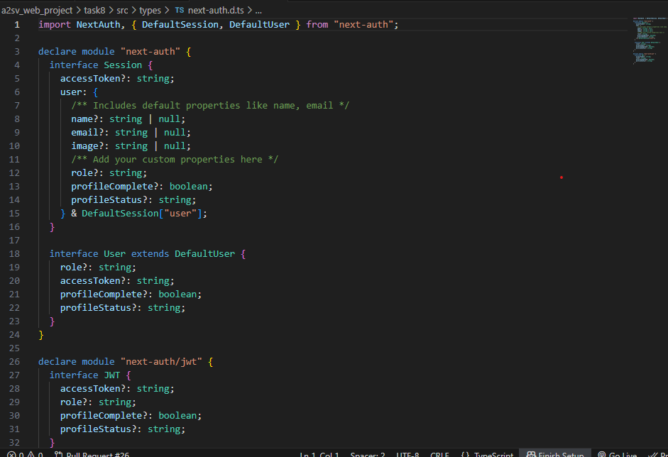

This component renders a reusable styled input field with a label, accepting props for id, label, type, value, change handler, and optional required flag.
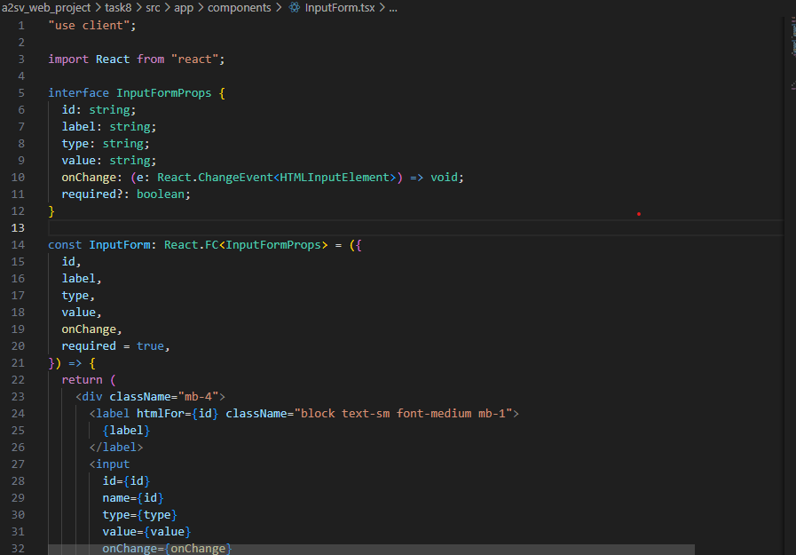
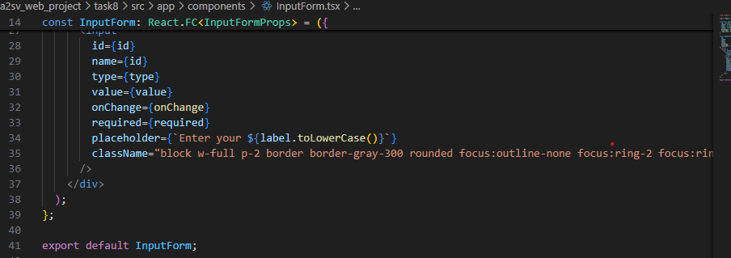

This component wraps your app with SessionProvider to enable NextAuth session access (useSession) throughout the client-side React tree.
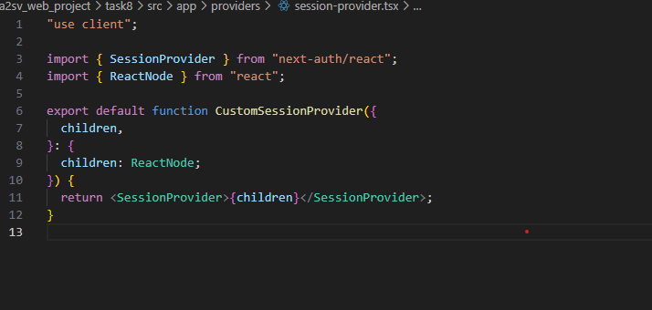

This SigninForm component renders a styled login form that collects email and password, calls signIn via NextAuth’s credentials provider, handles errors, and redirects to the homepage on success.It uses local state to track form inputs and shows validation errors if login fails.
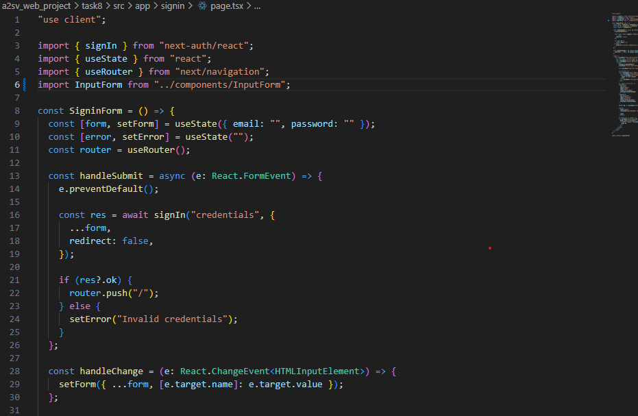
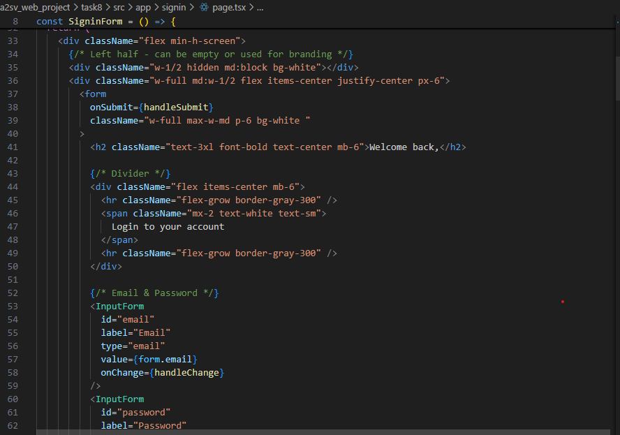
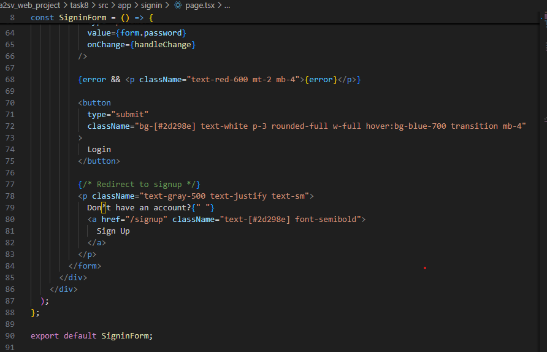

This Signup component renders a styled registration form that collects user details, validates inputs, and sends a POST request to the backend /signup API.
If successful, it redirects to the /verify page for OTP email verification

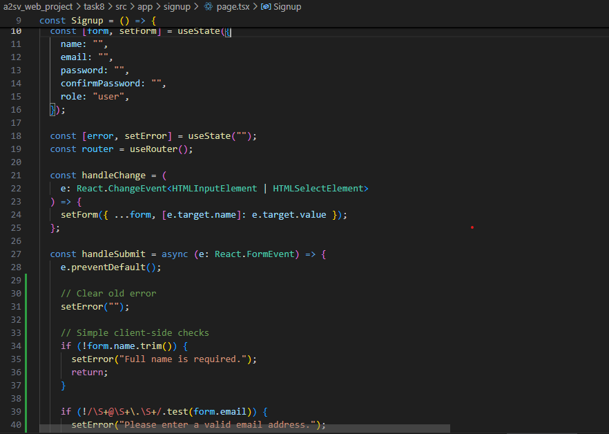
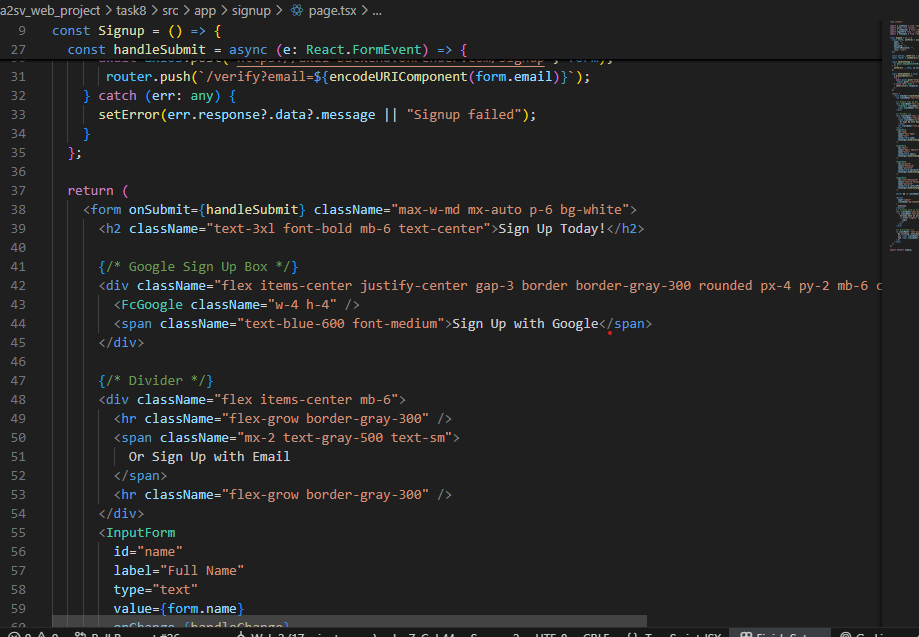
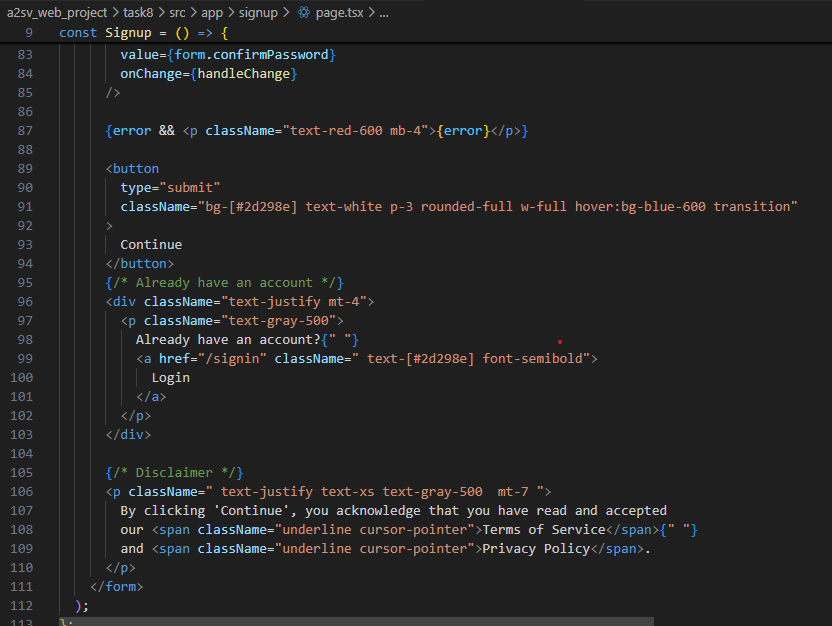

This VerifyEmail component lets users enter a 4-digit OTP sent to their email, validates it, and sends it to the backend for verification.It manages input focus, restricts non-numeric values, shows errors, and redirects to /signin on success.A countdown timer prevents resending immediately and enhances UX by showing a delay before retrying.

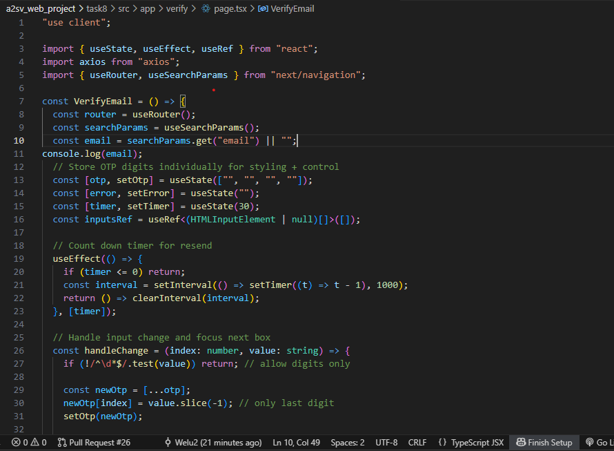
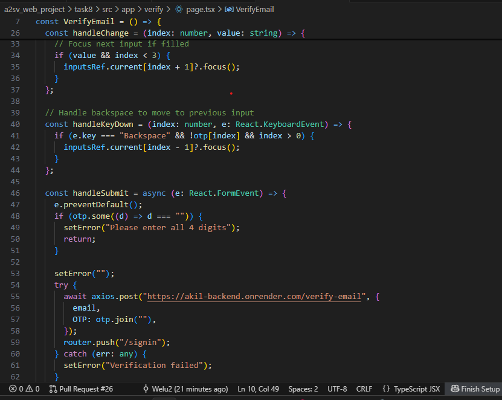
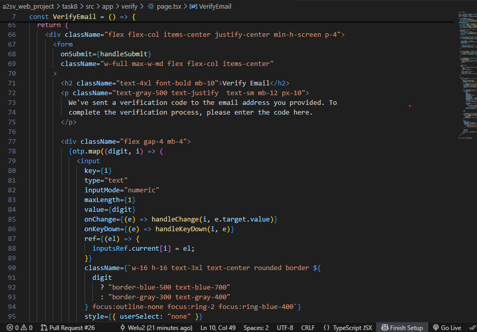
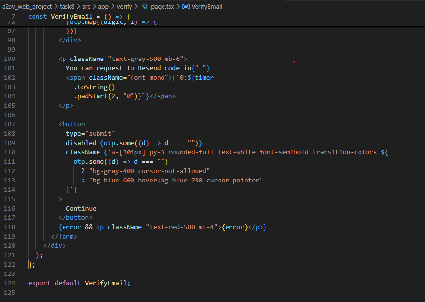
